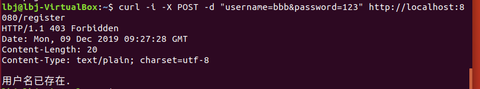

### XINHELIANSHENG-SeviceComputing_简单 web 服务与客户端开发实战

资源来源：[SWAPI](https://swapi.co/)

#### API

##### 认证方式

需要身份验证的请求，如果账号不存在或者密码错误，将返回`403 Forbidden`

- 注册

```
curl -i -X POST -d "username=123&password=123" http://localhost:8080/register
```

**示例**


- 登录

```
curl -i -X POST -d "username=123&password=123" http://localhost:8080/login
```

**示例**

成功


失败




##### 资源获取

- 使用`GET`请求资源，路径的最后是请求的资源类型。

```
GET http://localhost:8080/api/films
GET http://localhost:8080/api/people
GET http://localhost:8080/api/planets
GET http://localhost:8080/api/species
GET http://localhost:8080/api/starships
GET http://localhost:8080/api/vehicles
```


- 使用`curl`请求资源

默认返回的内容

```
curl -i http://localhost:8080/api/films
curl -i http://localhost:8080/api/people
curl -i http://localhost:8080/api/planets
curl -i http://localhost:8080/api/species
curl -i http://localhost:8080/api/starships
curl -i http://localhost:8080/api/vehicles
```

返回对应序号的成员

```
curl -i http://localhost:8080/api/films/%d
curl -i http://localhost:8080/api/people/%d
curl -i http://localhost:8080/api/planets/%d
curl -i http://localhost:8080/api/species/%d
curl -i http://localhost:8080/api/starships/%d
curl -i http://localhost:8080/api/vehicles/%d
```

**示例**

如下是查看`people`中的第一个元素。

```
VirtualBox:~$ curl -i http://localhost:8080/api/people/1
HTTP/1.1 200 OK
Date: Mon, 09 Dec 2019 08:53:32 GMT
Content-Length: 829
Content-Type: text/plain; charset=utf-8

{
  "name": "Luke Skywalker",
  "height": "172",
  "mass": "77",
  "hair_color": "blond",
  "skin_color": "fair",
  "eye_color": "blue",
  "birth_year": "19BBY",
  "gender": "male",
  "homeworld": "https://swapi.co/api/planets/1/",
  "films": [
    "https://swapi.co/api/films/2/",
    "https://swapi.co/api/films/6/",
    "https://swapi.co/api/films/3/",
    "https://swapi.co/api/films/1/",
    "https://swapi.co/api/films/7/"
  ],
  "species": [
    "https://swapi.co/api/species/1/"
  ],
  "vehicles": [
    "https://swapi.co/api/vehicles/14/",
    "https://swapi.co/api/vehicles/30/"
  ],
  "starships": [
    "https://swapi.co/api/starships/12/",
    "https://swapi.co/api/starships/22/"
  ],
  "created": "2014-12-09T13:50:51.644000Z",
  "edited": "2014-12-20T21:17:56.891000Z",
  "url": "https://swapi.co/api/people/1/"
}
```


#### 客户端界面

- 主界面


- 注册界面


注册失败，用户名重复。


- 登录界面


登录失败，账户不存在或密码错误。


- 查询


